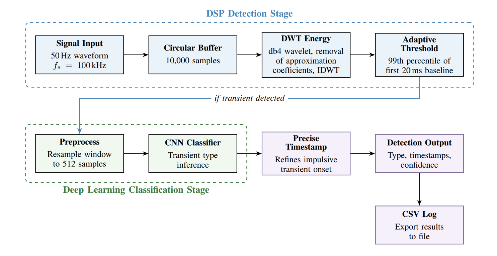
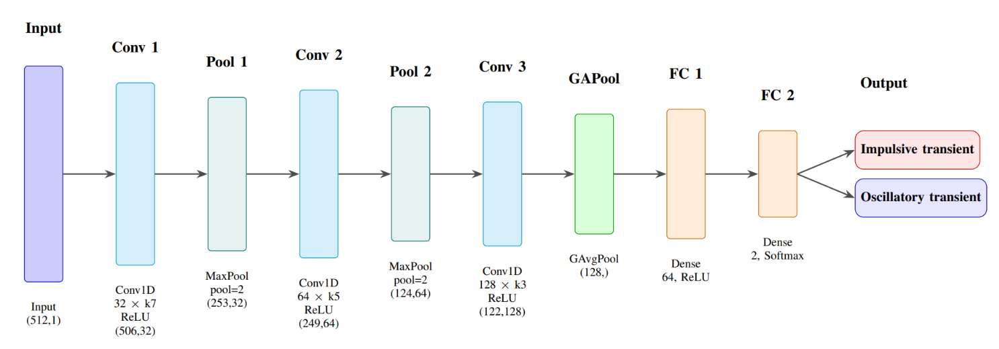
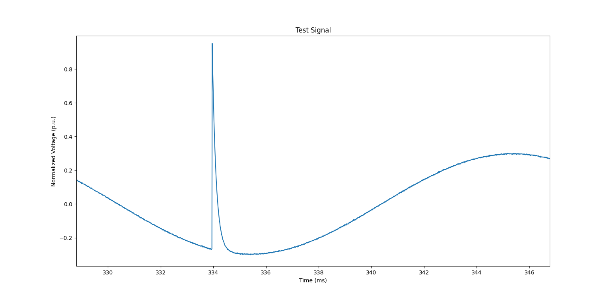
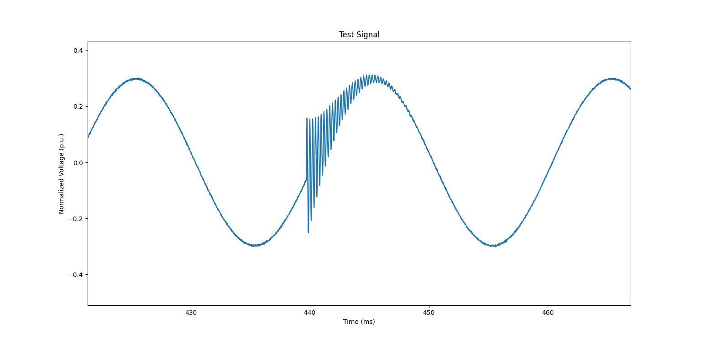
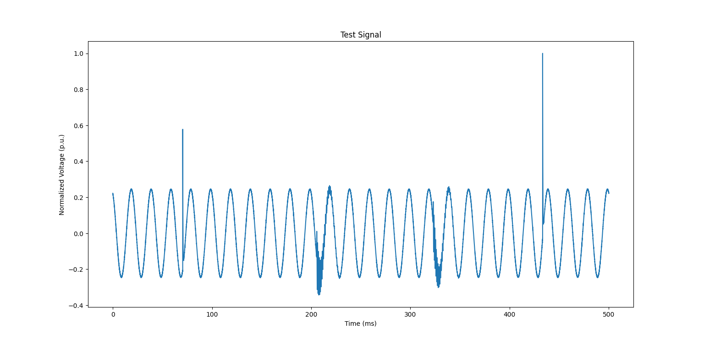
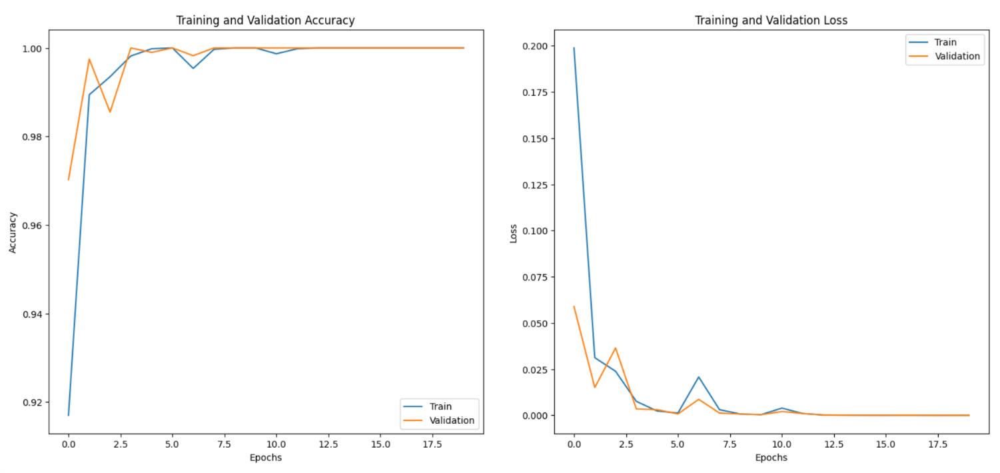

# streaming-pqd-detection

**Author:** Alphy Ajit Cherian

# Executive Summary

Power quality disturbances (PQDs) such as impulsive and oscillatory transients are momentary but destructive, often leading to equipment failure. This project implements a hybrid signal-processing and deep-learning pipeline for continuous power quality transient monitoring. Wavelet energy is used to detect transient events and localize their timestamps, while a lightweight 1D CNN classifies them.

1. Enables signal streaming via a circular buffer architecture for continuous monitoring
2. Employs an event-driven inference mechanism, where the convolutional neural network (CNN) is called only upon transient detection thereby reducing computational overhead enabling future microcontroller deployment

  

<em>System Block Diagram</em>

Full writeup: [Wavelet-Triggered Deep Learning for Transient Power Quality Disturbance Detection and Classification](paper.pdf)

---

# How It Works

## 1. Detection — Wavelet Energy Triggering

The incoming signal (100kHz sample rate) is buffered in a 10,000 sample circular buffer (100ms window) to support continuous streaming. The buffered signal is decomposed via a 6 level Discrete Wavelet Transform using the db4 (Daubechies-4) wavelet.

At 6 levels of decomposition, the approximation band (a₆) narrows to 0–781.25Hz — containing the 50Hz fundamental — while the detail bands (d₁–d₆) span 781.25Hz–50kHz:

| Level (n) | Approximation Band ($$a_n$$) | Detail Band ($$d_n$$) |
|:---:|:---:|:---:|
| 1 | 0 – 25 kHz | 25 – 50 kHz |
| 2 | 0 – 12.5 kHz | 12.5 – 25 kHz |
| 3 | 0 – 6.25 kHz | 6.25 – 12.5 kHz |
| 4 | 0 – 3.125 kHz | 3.125 – 6.25 kHz |
| 5 | 0 – 1.5625 kHz | 1.5625 – 3.125 kHz |
| 6 | 0 – 781.25 Hz | 781.25 Hz – 1.5625 kHz |

Six levels of decomposition were chosen to narrow the $a_6$ approximation band to a range (0–781 Hz) that includes the 50 Hz fundamental for more precise filtering. The signal is then reconstructed from these detail coefficients via Inverse Discrete Wavelet Transform (IDWT). To ensure that the system is robust to varying levels of noise, an adaptive threshold is set as 10 times the energy of the 99th percentile of the first 20ms baseline signal.

Crucially, the first 20ms are reserved as setup time for the system during which transients are not expected to be present. Once the DWT energy exceeds the adaptive threshold, the system triggers the second stage for transient type classification. The trigger based mechanism ensures that the CNN is called only when a transient is detected, as opposed to operating it continuously.

## 2. Classification — 1D CNN

Once triggered, the transient window is extracted from the buffer, resampled to a fixed 512 samples, and classified.

  

| Hyperparameter | Value |
|:---|:---:|
| Optimizer | Adam |
| Learning rate | 0.001 |
| Loss function | Sparse categorical cross-entropy |
| Epochs | 20 |
| Batch size | 32 |
| Validation split | 0.2 |

| Model Property | Value |
|:---|:---:|
| Trainable parameters | 43,650 |
| Model size (float32) | 170.5 KB |
| Model size (int8, quantized) | 42.6 KB |

The final classification type, localized start/end timestamps, and CNN confidence score are logged to a CSV file if the user so wishes.

---

# Signal Model

Both training and evaluation signals are synthetic, generated per IEEE Std 1159-2019 parameter ranges, built around a 50Hz, 240√2V fundamental with additive Gaussian noise (0.5% of peak amplitude, ~43dB SNR).

**Impulsive Transient**

According to IEEE 1159, "An impulsive transient is a sudden, nonpower frequency change from the nominal condition of voltage, current, or both, that is unidirectional in polarity".

$$y(t) = A\left[\sin(\omega t + \phi) + \alpha \cdot \Psi \cdot e^{-\frac{t-t_1}{\tau}} \cdot u(t-t_1)\right] + n(t)$$

  

**Oscillatory Transient:**

According to IEEE 1159, "An oscillatory transient is a sudden, nonpower frequency change in the steady-state condition of voltage, current, or both, that includes both positive and negative polarity values"

$$y(t) = A\left[\sin(\omega t + \phi) + \alpha \cdot e^{-\frac{t-t_1}{\tau}} \cdot \sin(\omega_n(t-t_1)) \cdot u(t-t_1)\right] + n(t)$$

  

### Signal Model Parameter Definitions

| Parameter | Value | Description |
| --- | --- | --- |
| $A$ | $240\sqrt{2}\text{ V}$ | Peak voltage amplitude |
| $\omega$ | $2\pi f$ (where $f = 50\text{ Hz}$) | Angular frequency of the fundamental component |
| $\phi$ | $\phi \in [0, 2\pi)$ | Random initial phase angle |
| $u(t)$ | — | Unit step function (handles transient activation timing) |
| $n(t)$ | Zero mean, $\sigma = 0.005A$ | Gaussian Noise  |

| Parameter | Impulsive | Oscillatory |
|:---|:---:|:---:|
| Relative magnitude ($$\alpha$$) | 0.5 – 5 | 0.1 – 0.8 |
| Duration (d) | 200 µs – 1 ms | 0.3 – 50 ms |
| Frequency ($$f_n$$) | – | 1 – 5 kHz |
| Polarity ($$\psi$$) | {−1, 1} | – |
| Time constant ($$\tau$$) | d / 4.605 | d / 4.605 |

  

<em>An example of a randomly generated test signal.</em>

---

# Results

Evaluated over 10,000 test signals, each containing 4 injected transients (2 impulsive, 2 oscillatory) — 40,000 total disturbances.

## System Performance

| Metric | Value |
|:---|:---:|
| Detection rate | 99.99% (39,997 / 40,000) |
| Classification accuracy | 99.42% (39,764 / 39,997) |
| Mean impulsive timing error | 0.015 ms |
| Mean oscillatory timing error | 0.193 ms |
| False alarm rate | 0.25% (99 / 39,997) |

## Confusion Matrix (40,000 disturbances)

| | Predicted Impulsive | Predicted Oscillatory |
|:---|:---:|:---:|
| **Actual Impulsive** | 19,767 | 233 |
| **Actual Oscillatory** | 0 | 19,997 |

## Classification Metrics

| Metric | Impulsive | Oscillatory |
|:---|:---:|:---:|
| Precision | 100% | 98.85% |
| Recall | 98.85% | 100% |
| F1 Score | 0.994 | 0.994 |

  

<em>Accuracy and Loss Curves</em>

## Observations

- Detection achieved near perfect performance, missing only 3 of 40,000 disturbances. All oscillatory, concentrated at low relative magnitude (α ≈ 0.1) and short duration (d ≈ 0.3ms), i.e. the edge cases of the IEEE 1159 parameter ranges.
- All 233 misclassifications were impulsive transients predicted as oscillatory. No oscillatory transients were misclassified.
- Impulsive timing error (0.015ms) was approximately 10× lower than oscillatory timing error (0.193ms)
- The model converges rapidly (see figure above), exceeding 99% accuracy within the first 5 epochs. The loss function was observed to drop sharply and approach zero. Both the training and validation curves were closely aligned with one another confirming that the model was not overfitting.

---

# File Overview

> Requires **Python 3.11**.

| File | Description |
|:---|:---|
| `main.py` | Core streaming detector |
| `train.py` | Builds and trains the CNN on data generated by `signal_generator.py`. Saves `transient_classifier.keras`. |
| `evaluate.py` | Batch evaluation. Runs the full detect and classify pipeline against many synthetic test signals with known ground truth and reports detection rate, classification accuracy, timing error, and confusion matrix. |
| `dataset.py` | Preprocessing (resampling, normalization) and labeled training data generation |
| `signal_generator.py` | Generates transients used for training CNN |
| `generate_test_signal.py` | Generates longer (500ms) streaming test signals with multiple randomly placed transients. |

---

# Limitations & Future Work

- **Synthetic training and evaluation data only.** The system has not yet been validated against real recorded power quality disturbance data.
- **Two class classification.** Real world PQDs include additional categories (sag, swell, harmonic distortion, etc) not covered here.
